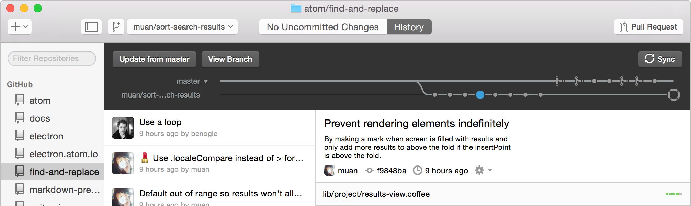
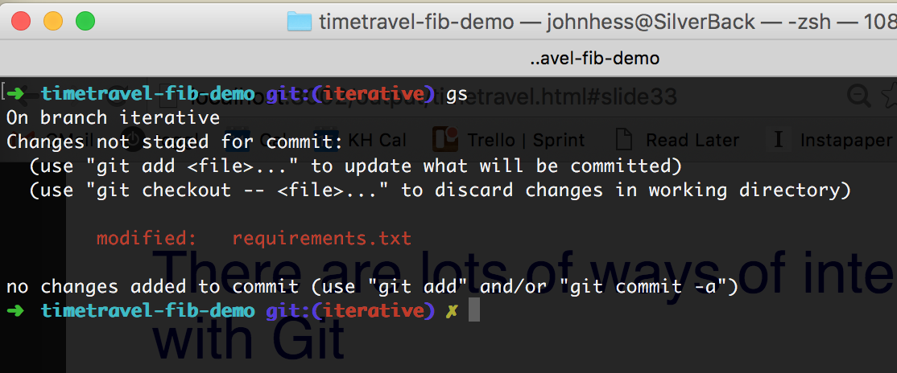
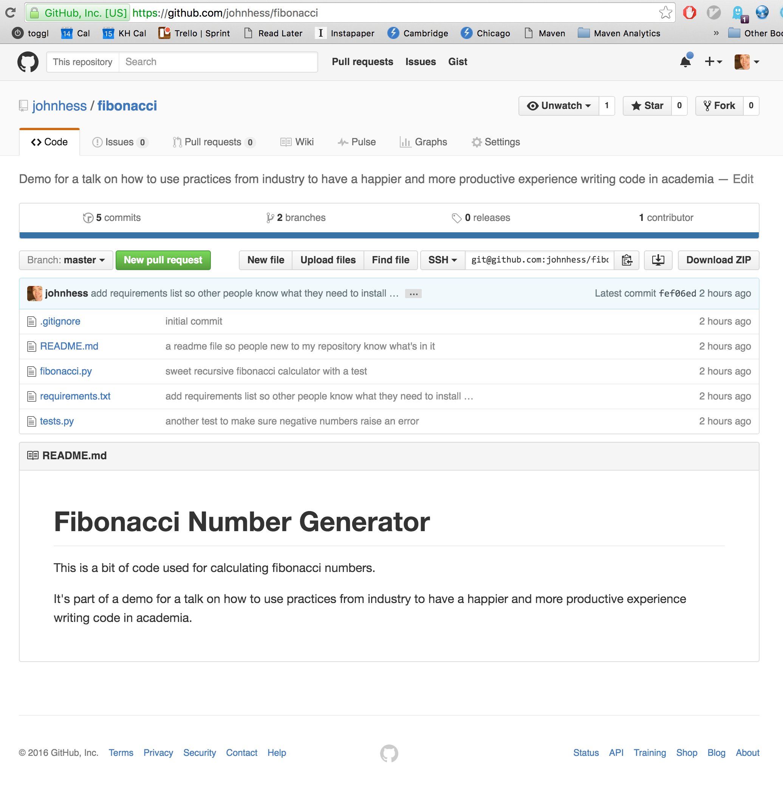
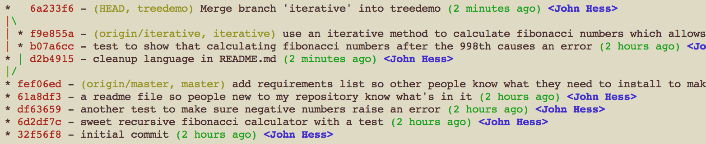
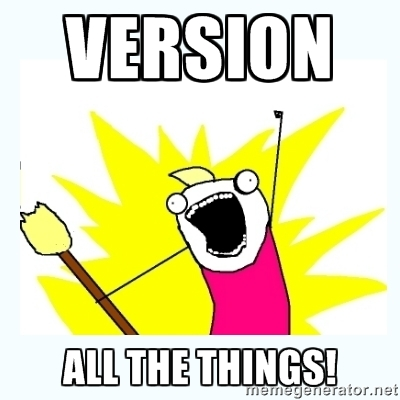

# Coding Practices Worth Stealing from Industry

---

## Who am I?

* Former TPPer
* Perpetrator of countless great sins of programming
* Working software engineer, amongst other things

---

## What's this talk about?

* Things I wish *I'd* have known 7 years ago
* Some tools to do things you already do, just better
* Dispelling belief in magic (maybe)

## Presenter Notes

* What is belief in magic

---

# What's this talk *not* about?

.fx: imageslide whiteheading

## Presenter Notes

I'll show a few things.  Python, heroku, nose, etc.  They're just examples of things that exist for most general purpose languages.

---

## Obligatory Motivation Slide

Research, collaboration, peer review and publishing are perfect processes because people don't make mistakes and always understand one another perfectly.

---

## Obligatory Motivation Slide

Research, collaboration, peer review and publishing are perfect processes because people don't make mistakes and always understand one another perfectly.

Right...

---

So, let's take a look at a few things we could do better.

1. Correctness
2. Collaboration
3. Replicability
4. Publishing code

---

# Correctness

---

---

.fx: imageslide

## Presenter Notes

* It's never good to see your face in the monologue...

---

## Getting code right turns out to be difficult...

* Hard to believe, but this isn't a problem unique to Harvard!
* Industry Average: "about 15 - 50 errors per 1000 lines of delivered
code." *[Code Complete, Steve McConnel]*
* Your research is important &#8756; *correctness matters*.
* There are tools for this!

## Presenter Notes

The only citation in this whole presentation!

---

How do *you* verify correctness?

---

# Automated Testing

---

## Automated Testing

Code that tests other code.  It has the same advantages code does:

* It's fast & easy
* It's consistent
* Other people can read it

## Presenter Notes

Until a friend and mentor of mine sat with me and helped me write my first tests, testing was black magic to me.  

The difference it's made in my productivity & quality is too big to understate.

---

.fx: imageslide

---

## Example!

    !python
    # fib.py
    def fib(n):
        # recursively calculate Fibonaacci numbers
        if n == 0:
            return 0
        elif n == 1:
            return 1
        else:
            return fib(n-1) + fib(n-2)

---

How do we know it's right?  I mean, it *looks* right...  Right?

---

## A test!

    !python
    # tests.py
    from fib import fib

    def test_fib_output():
        # Check some known values
        assert fib(0) == 0
        assert fib(1) == 1
        assert fib(2) == 1
        assert fib(3) == 2
        assert fib(4) == 3
        assert fib(5) == 5

---

## Run the tests!

(`nosetests` is just a program that automatically finds and runs your tests)

    !bash
    $ nosetests
    .
    ----------------------------------------------------------------------
    Ran 1 test in 0.001s

    OK

Success!

---

## Good!  Now what?

On with our lives!  We can change the code, our colleagues can change it, we can build on top of it, etc.

Alas, we soon find that this algorithm only gets us so far.

    !python
    >>> fib(1000)
    ...
    RuntimeError: maximum recursion depth exceeded

Well, crap.

---

## Crap!  Now what?

We *could* just go and fix this.

But we can do one better!  Let's write a *new* test to cover this case:

    !python
    def test_fibr_large_numbers():
        assert fibr(1000) > 0 # who even knows the 1000th Fibonacci number?!

and run it...

---

## Run the tests!

    !text
    .E
    ----------------------------------------------------------------------
    Ran 2 tests in 0.015s

    FAILED (errors=1)
    Failed - Back to work!

---

## A safety net for our high-flying mathematical and programming tricks

Let's replace our recursive `fib()` function with an iterative one!

Normally, we'd have to be really careful and make sure the new one just right.  But instead, we have tests now to make sure we don't break anything.

---

## A safety net for our high-flying mathematical and programming tricks

Iterative version!

    !python
    # fib.py
    def fib(n):
        # iterative Fibonaacci calculation
        a, b = 0, 1
        for i in range(0, n):
            a, b = b, a + b
        return a

Now run our exact same existing tests...

---

## Run the tests!

    !text
    ..
    ----------------------------------------------------------------------
    Ran 2 tests in 0.015s

    OK

Hooray!

---

## Testing

* Tests at different levels
    * lowest levels (a.k.a. "Unit Testing")
    * highest levels (a.k.a. "Functional/Integration Testing")
* Check out what's available in your language.  You'd be surprised how easy people have made it to write and run tests.

---

# Collaboration

## Presenter Notes

Including collaboration with *future* you!

---

How do you collaborate with your colleagues?  Email?  Dropbox?  Something better?  Something worse?

Who here routinely runs software written by other researchers?  Who improves on it?

## Presenter Notes

* This is a big problem out there in the world, and it only gets bigger as you work on more in-depth projects
* It's not only a problem you find, but *if you have a solution*, you can do all sorts of things nobody'd bother with in the first place, like building off one another's code instead of writing every damned thing from scratch.

---

## Enter Version Control

*The* way that coders collaborate in the modern world.

---

## Wisdom from Stack Overflow 

Have you ever:

* Made a change to code, realised it was a mistake and wanted to revert back?
* Lost code or had a backup that was too old?
* Had to maintain multiple versions of a product?
* Wanted to see the difference between two (or more) versions of your code?
* Wanted to prove that a particular change broke or fixed a piece of code?

## Presenter Notes

...you *do* use Stack Overflow, right?

---

* Wanted to review the history of some code?
* Wanted to submit a change to someone else's code?
* Wanted to share your code, or let other people work on your code?
* Wanted to see how much work is being done, and where, when and by whom?
* Wanted to experiment with a new feature without interfering with working code?

*(courtesy of the illustrious SO user si618, content CC BY-SA)*

---

## Okay, okay.  I see the light!  How do I use version control?

Think of it like email.

Github : Git :: Gmail : Email

## Presenter Notes

* Explain email analogy.  Talk about command line, GUI, web-based, etc.
* There's this other neat corrolary of that relationship.  When you have such a well defined protocol lots of stuff works with it (foreshadowing!)
* You thought you were done with those after you took the SAT, huh?

---

## How to use Git in 5 minutes or less

*(or, how to keep your sanity working in teams!)*

We start by creating a git repository and hosting it somewhere everyone can get to it.  Think of it like a dropbox folder with super powers tailor made for coding.

---

All the cool kids these days are using github, so we will too!

---

## Step 0: Make that repository! 

Creating a repository is actually pretty easy, and GitHub's documentation is particularly good:

https://help.github.com/ 

*(see "Good Resources for Learing Git and Github")*

---

## Desktop GUI applications

## Presenter Notes

Remember, it's like email -- you can use git via a GUI

---

## The command line

---

## Web applications

*(at least for some functionality)*

---

## We've created our code repository, and it's holding our code as is.

Now what?

---

## Make some changes on their own "branch"

* Git is *all* about changes!

---

## When those changes are ready, pull them into the master version

* If you've ever heard the term "Pull Request", that's exactly what we're talking about
* You can use this on your own or with a team
* It means multiple people can work on the same code without ending up with the dreaded diverging "personal" versions

---

## The "Pull Request"

* This is where it gets cool!
* A more true to life example

## Presenter Notes

* We were perfectly happy with our (slow & limited) recursive fibonacci number calculator, but one of our labmates is using our code and pesky, such as labmates are, they need it to calculate really big fibonacci numbers
* We get to go with the famous and passive agressive (in some circles) "Pull Requests Welcome!"
    * In other words, you want it, you write it!
    * Plus, we can optionally pull those changes back into our master version!

---

## An example Pull Request

[A real, live pull request](https://github.com/johnhess/fibonacci/pull/1)

---

## So with just a bit of git-fu

* You can publish/distribute your code in a convenient way
    * You can even mark specific versions like ("As used in Paper XYZ")
* You can work on the same code with others in your lab or around the world
* So, so much more (just you wait and see...)

---

## Oh! And, you can use it for other things!

* Multiple people try to edit one thing... sound familiar?
* These slides! [https://github.com/johnhess/time-travel](https://github.com/johnhess/time-travel)

---

.fx: imageslide

---

## A brief reality check

* Git actually has a pretty steep learning curve :-/

But, if you program every week and especially if you program with other people it is *SO* worth learning.

## Presenter Notes

And it works with all sorts of great tools

---

# Let's be serious academics for a minute

---

# Publishing

## Presenter Notes

It matters.

We can go through the motions, but we can also do better.

And, we can do better in two ways.

* Replicability
* Reach

---

## Replicability

* Publish your methodology
* *Publish your code*
    * Archivally
    * Accessibly
    * Understandably
    * Extensibly
    * Interactively

---

# Crash Course:  Internet

## Presenter Notes

Administering and maintaining the whole thing is expensive and time consuming.

There is a better way!

---

# Use a Cookie Cutter!

.fx: imageslide whiteheading

## Presenter Notes

I can't stress enough how many ways there are to make software available on the Internet.

I'll talk about just one, my favorite, but there are many, many good ones out there.

It turns out that this makes life easier even if you don't use heroku, etc.

---

## Heroku

* Give it your code
* Makes running version available at yourthing.herokuapp.com

---

## What shape is this cookie-cutter?

* Needs to be in a supported language
* Needs one script to run that can "answer the phone"
    * What should the user get at `yourthing.herokuapp.com`
    * What should the user get at `yourthing.herokuapp.com/some/path/to/thing/10`
* Needs to know how to start that script
* Needs to know what dependencies you code has (any libraries you use, etc.)

---

If only there was a good way to express exactly what that looked like compared to our existing code...

---

If only there was a good way to express exactly what that looked like compared to our existing code...

[A wild pull request appeared](https://github.com/johnhess/fibonacci/pull/3/files)

---

# [Heroku Demo]

## Presenter Notes

* Walk through pull request
* Heroku
    * Create application
    * It attaches straight to github, that's cool
    * 

---

So, starting from our original fibonacci code, we've got

* Some guarantee of correctness (1) 
* A medium for collaboration (2) 
* A sane way for others to inspect and run the code behind our research publications (3)
* A way to reach non-coders and share the ideas in our code (4)

---

 
 
 
 
 
 
 
 
 
 
 
 
John Hess
 
john@jthess.com